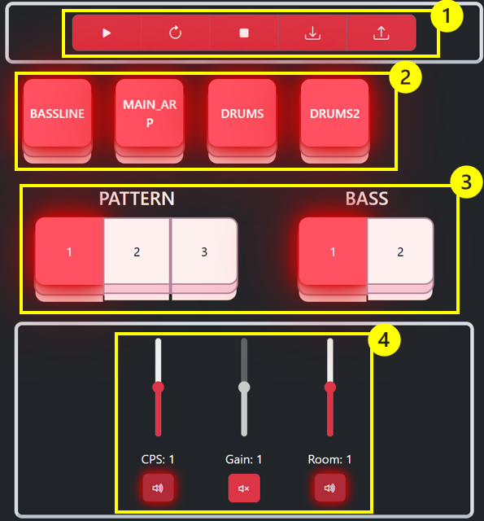

# Strudal Refactor
#### Author: twedy001

## Installation

Clone the project

```bash
  git clone https://github.com/Morlenn/strudel_reactor.git
```

Install dependencies

```bash
  npm install
```

Start the server

```bash
  npm start
```

*Note: this will launch both server and client within the same terminal, with labeled outputs.*

## Controls



1. Navigation buttons:
    - Play: Plays current track
    - Refresh: Loads in changes and plays (disabled while no changes)
    - Stop: Stops currently playing track
    - Save: Display a dialogue allowing you to save your current track.
    - Load: Allows you to load a track from saved data.  

2. Hush Buttons: Enable and disable matching keyed sounds.
3. Toggle Groups: Toggles any patterns identified as "pick" functions.
4. Sliders: When enabled, applies a modifier to all related functions.

## Element Generation
All elements, save the navigation buttons are dynamicly created by parsing a track once loaded.

### Hush Buttons
Hush buttons are generated by keyed/labeled sounds (i.e. 'drums:').

*Note: keys currently must be unique, otherwise regex matching will not work correctly.*

### Toggle Groups
Toggle groups are generated by matching a delcared variable, with an array. It will do this by trying to match the two within a pick function.

For example:
```javascript
const pattern = 0

const gain_patterns = [
  "2",
  "{0.75 2.5}*4",
    "{0.75 2.5!9 0.75 2.5!5 0.75 2.5 0.75 2.5!7 0.75 2.5!3 <2.5 0.75> 2.5}%16",
]

note.pick(gain_patterns, pattern)
```

Above pattern and gain_patterns would be a match and generate a toggle group based on the arrays length.

### Sliders

Sliders for approved functions can be generated, which apply a modifier based on the sliders value. 

The current aprroved list, as found in TuneProcessor.js:
```javascript
static sliders = ['gain', 'distort', 'room', 'roomsize', 'delay', 'coarse', 'phaser', 'crush'];
```

setcpm and setcps are also controlled globally via a slider, if one isn't found during processing, ***setcpm(30)*** will be appended to the track with a slider to control it.

Sliders will apply a modifier globally to each matching function, for example the room and delay values below:

```javascript
gm_ocarina: chord("<Am Am7 C Gm>/8").dict('ireal').anchor('A3')
.voicing()
.sound('gm_ocarina')
.off(.2, x=>x.velocity("<.4 .2 .3>*16"))
.room(.8 * 1.3)
.delay(.1 * 0.5)
.gain("<0 0 [.3 .4.5 .6] .7 .7!16>/32")
.mask("<[0 0] 0 1 1 1!16>/32".early(.05))
```

## Program Quirks
### Hush Buttons
As mentioned above, hush buttons / keyed sounds must be unique otherwise their functionality will break. Currently this is controlled via string.replace() method, so will only match the first instance/

### Toggle Groups
The regex that replaces a variable related to the toggle group, is based off string index at the time of load. If any text is appended above this declaration, the functionality breaks.

### Saving Tracks
Savinging doesn't currently check for tracks that are keyed by your passed saved name. If a song with that key is already present, it will be overwritten.

### server.js
I've written a short, janky express 'backend' to handle the saving and loading of JSON data. I wanted to simulate a backend/client relationship, and misunderstood the need for JSON maniputlation in the assignment. I later found out all that was required was use a object in local storage.

## Strudel Bakery Content
All tracks used in the assignment were sourced from the strudel bakery, as I have zero musical talent.

### Bergheini auf dem Weg nach Hause 
@by **$$$otter**
https://live.strudel.cc/?xOKzOq28QWdD

### man in finance
@by **v10101a88, enelg, froos**
https://live.strudel.cc/?bbI7dpe_6WD6

### stranger_tune 
This was provided in the source code but was adapted from Algorave Dave's code found here: https://www.youtube.com/watch?v=ZCcpWzhekEY

